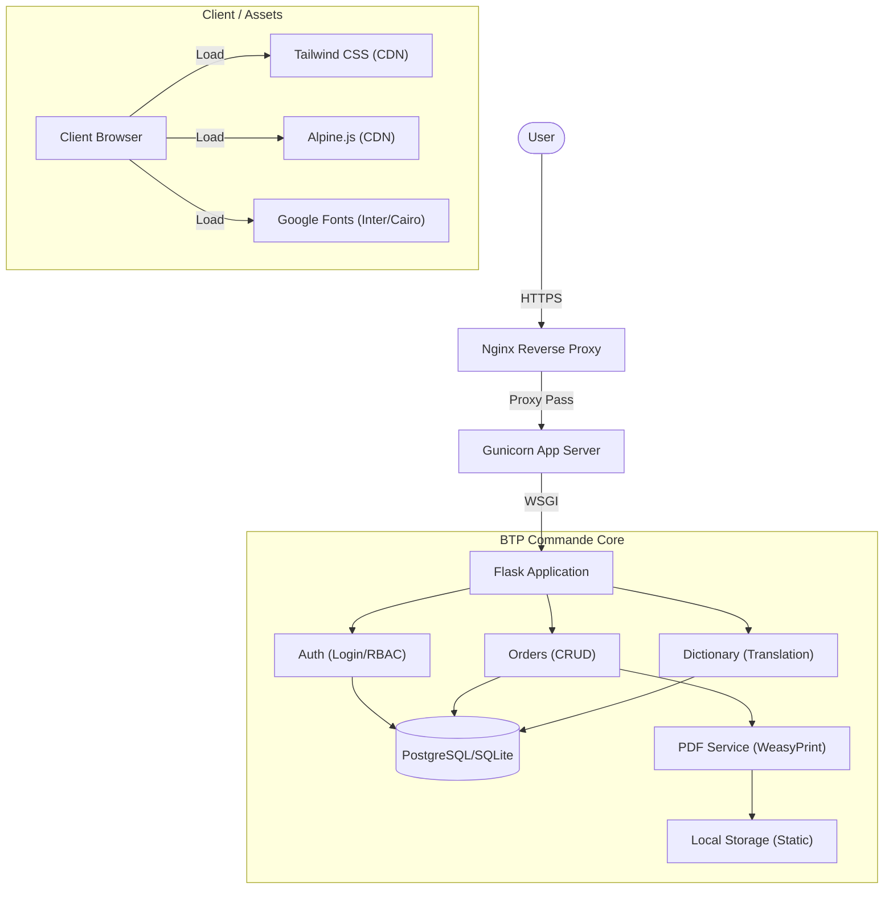

     

[ 🇫🇷 Français ](README.md) | [ 🇬🇧 **English** ](README_en.md)

# BTP Commande - Procurement Management Platform

> **LEGAL NOTICE:** This software is the exclusive property of **MOA Digital Agency**. Any unauthorized reproduction, distribution, or use is strictly prohibited. Confidential source code.

## 📌 Overview

**BTP Commande** is a proprietary SaaS solution designed to optimize and secure the purchasing process in the Construction and Public Works sector. It enables complete management of the order lifecycle, from draft creation to the generation of official PDF purchase orders, with a strong focus on technical translation (French / Arabic / Darija) to facilitate communication with suppliers.

## 🏗️ Technical Architecture



## 📚 Documentation

All technical and functional documentation is available in the `docs/` folder.

| Document | Description | Audience |
| :--- | :--- | :--- |
| [**Feature Bible**](docs/BTP_Commande_features_full_list_en.md) | Exhaustive list of all business rules and micro-features. | Product Owners / Devs |
| [**Technical Architecture**](docs/BTP_Commande_technical_architecture_en.md) | Details on the stack, database, and flows. | Developers / DevOps |
| [**Deployment Guide**](docs/BTP_Commande_deployment_guide_en.md) | Installation procedures (Local & VPS). | DevOps / SysAdmin |
| [**User Manual**](docs/BTP_Commande_user_guide_en.md) | Usage guide for site managers and buyers. | End Users |

## ✨ Key Features

*   **Strict Validation Workflow:** Draft -> Submitted -> Validated -> PDF Generated.
*   **WeasyPrint PDF Engine:** High-fidelity document generation with LFI protection.
*   **Smart Dictionary:** Automatic translation of technical construction terms.
*   **Multi-Tenant:** Total data isolation per company.
*   **Responsive Interface:** Powered by Alpine.js for a fluid experience without SPA overhead.

## 🚀 Quick Install (Dev)

See the [Deployment Guide](docs/BTP_Commande_deployment_guide_en.md) for full details.

```bash
# 1. Clone repository (Restricted access)
git clone <internal-url>

# 2. Install dependencies
pip install -r requirements.txt

# 3. Initialize DB
python init_db.py

# 4. Run server
flask run
```

---
&copy; 2024 MOA Digital Agency. All rights reserved. Author: Aisance KALONJI.
